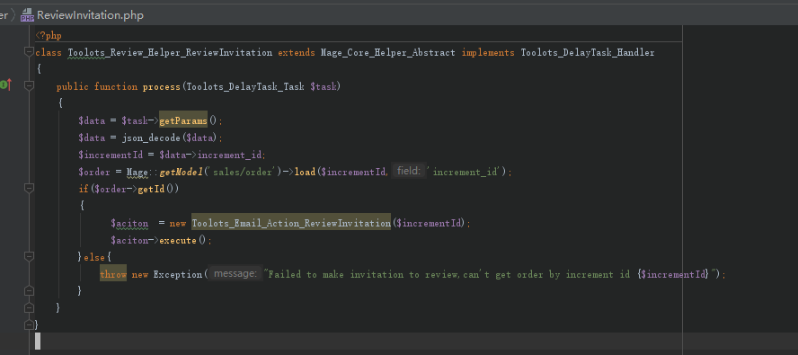

Delay Task
========================

How to use?
^^^^^^^^^^^^^^^

Here's an example to create a task that will be executed after 30 days

At first , you have to make sure there is a 'task handler' to deal with your task.
  'task handler' should be an 'magento helper' and extends trait 'Toolots_DelayTask_Handler'

Then , you can call demo code below to build a delay task.

.. code-block:: php

            $data = ['increment_id'=>$order->getIncrementId()];
            $task = Toolots_Components_Helper_DelayTask::newDelaytask('toolots_review/reviewinvitation',$data,"30 days");
            $task->save();

Once this task created , Toolots_Review_Helper_ReviewInvitation::process($thisTask) will be called after 30 days from now on.

