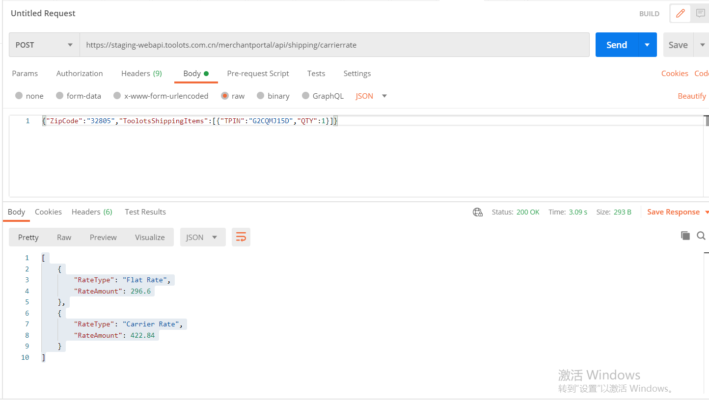
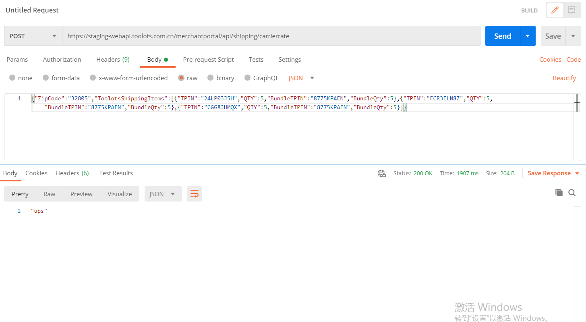

Shipping Things
=================

EconomyShipping(TableRates)的计算规则 
^^^^^^^^^^^^^^^^^^^^^^^^^^^^^^^^^^^^^^^^^^^^^^^^^^^^^^^^^^^^^^^^^^^^^^^^^

       首先调用接口，由接口返回数据。调用接口失败的情况下，按照Magento原生的TableRates规则计算。

      
ShippingApi地址设置 
-----------------------------------

**Api For Staging**:
https://staging-webapi.toolots.com.cn/merchantportal/api/shipping/carrierrate

**Postman Example (Simple Product)**

**Postman Example (Bundle Product)**

调试相关
^^^^^^^^^^^^
生成shipping rates的客户端代码 ::

        $quote = Mage::getModel('checkout/cart')->getQuote();
        $address=$quote->getShippingAddress();
        $address->setCollectShippingRates(true);
        $address->collectShippingRates();
        $address->save();

计算ShippingRates ::

       $result = Mage::getModel('shipping/shipping')->collectRates($request)->getResult();
       $shippingRates = $result->getAllRates();

ShippingRate与QuoteAddress绑定 ::

      $quoteAddress->addShippingRate($rate);
